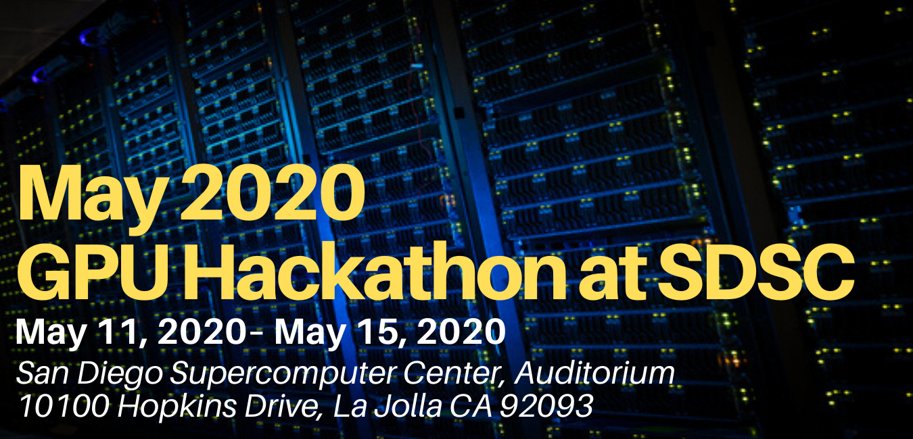

## The GPU Hackathon is coming to San Diego!
<b>If you have an application that you are thinking about porting to GPUs, or an application already using GPUs that could use a helping hand getting that next level of performance, you should consider submitting to the San Diego GPU Hackathon.</b>

What is a GPU hackathon?
SDSC GPU hackathons are 5-day intensive coding events that put application teams together with experts in programming and performance. The goal of the event is to port and optimize codes on GPU technologies in a focused, highly collaborative environment. GPU hackathons are part of an international program organized by NVIDIA to help train scientists and researchers to accelerate and optimize their applications on GPUs. 

## What is the format?
Each code team should consist of 4-6 code developers that together are intimately knowledgeable of the code. If a team proposal consists of a suite of applications, no more than two applications should be sent to the hackathon. For each individual code, at least 2 people must attend. Teams will be complimented by mentors that will be assigned based on expert knowledge that matches the needs of the code. Expertise in GPU computing is not required.
Selected teams will have access to large-scale GPU clusters for the duration of the event, including preparation and follow-up testing. 

## Who should attend?
Anyone developing or using HPC scientific codes seeking performance improvements, or porting to GPU systems in a cooperative, hands-on environment should apply. Codes should primarily be written in a GPU compatible language, such as C++, Fortran and/or Python. Codes can use/want any standard method of offloading work to the GPUs, including CUDA, RAPIDS, CUDA Fortran, OpenACC, OpenCL or OpenMP.
The SDSC GPU hackathon is interested in teams who are working with “long-tail” computational science applications that run well on the Comet (or future Expanse) architectures. However, all coding teams looking to use GPU technologies are encouraged to apply. A broad range of code types and GPU experience levels are sought for this event.

## Participant Costs
There is no registration fee to attend the event. Breakfast, lunch, coffee and snacks will be provided during the hackathon. Participants are responsible for all other expenses, including their transportation to and from the event, lodgings and other meals. Participants will also be expected to arrive with a laptop that is capable of wireless internet to work on for the duration of the event.

## Acceptance Timeline and Notification

<b>Applications Deadline: March 11, 2020</b>
 <b>Accepted applicants will be notified by: March 25, 2020</b> 
### Accepted teams should:
    * Register all team members for the event.
    * Review the attendee guide.
    * Mentor introductions and computational resource access instructions will be forthcoming.
[APPLY to SDSC's GPU Hackathon](https://gpuhackathons.org/form/register?hackathon_which_event=253)
>For a full list of GPU Hackathons, see https://gpuhackathons.org/ for more information.

## Venue
San Diego Supercomputer Center (SDSC) on the campus of UC San Diego
10100 Hopkins Drive, La Jolla, CA 92093
Location: SDSC Auditorium EB212 - located on the ground level just off the driveway and north of the Hopkins Parking Structure.

__Directions, parking and a full list of local hotel information__ can be found on the [SDSC Visitor Information](https://www.sdsc.edu/about_sdsc/visitor_info.html) page.  When making hotel reservations it is recommended to call hotel directly to ask for a “UCSD rate”.  

## Hotels located closest to SDSC and campus:

### [Estancia La Jolla Hotel and Spa](https://meritagecollection.com/estancia-la-jolla) <i>(located directly west of SDSC within a 5 min. walk)</i>

9700 N. Torrey Pines Road
 La Jolla CA 92037
 (858) 550-1000

### [Hilton La Jolla Torrey Pines](https://www3.hilton.com/en/hotels/california/hilton-la-jolla-torrey-pines-SANTPHH/index.html)

10950 N. Torrey Pines Rd.
 La Jolla, CA 92037
 (858) 558-1500

### [The Lodge at Torrey Pines](https://www.lodgetorreypines.com/)

11480 North Torrey Pines Rd.
 La Jolla CA 92037
 (858) 453-4420

### [The Residence Inn San Diego/La Jolla](https://www.marriott.com/hotels/travel/lajca-residence-inn-san-diego-la-jolla/)

8901 Gilman Dr.
 La Jolla, CA 92037
 (858) 587-1770
 (800) 331-3131

### [Sheraton La Jolla Hotel](https://www.marriott.com/hotels/travel/sanjs-sheraton-la-jolla-hotel/)

3299 Holiday Ct. 
 La Jolla, CA 92037  
 (866) 500-0335 (UCSD dedicated #)

## Questions?
You may submit any questions about the SDSC GPU Hackathon to: events@sdsc.edu

